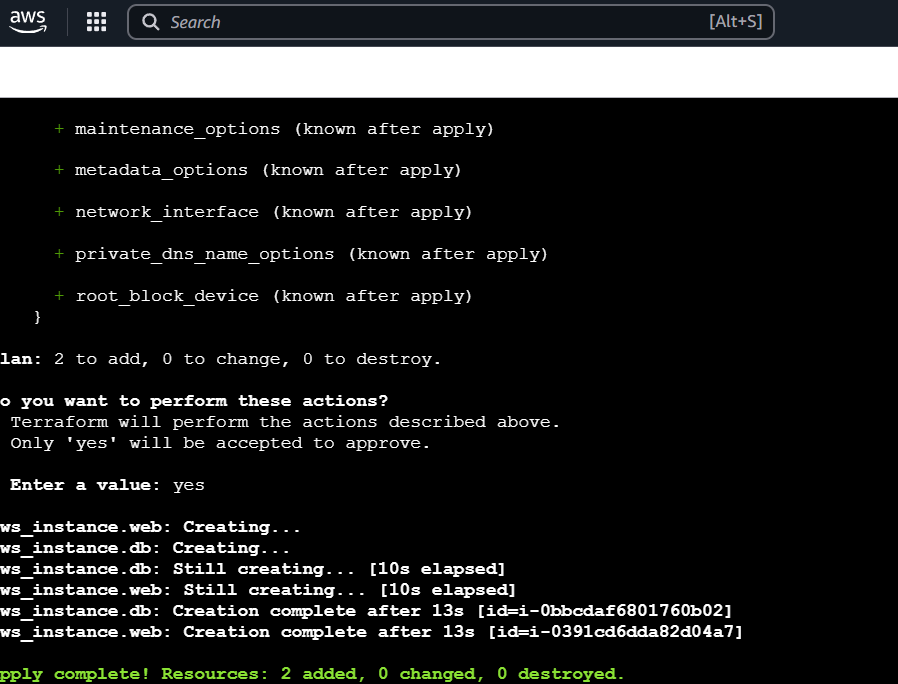
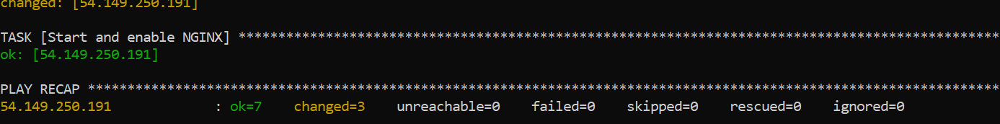
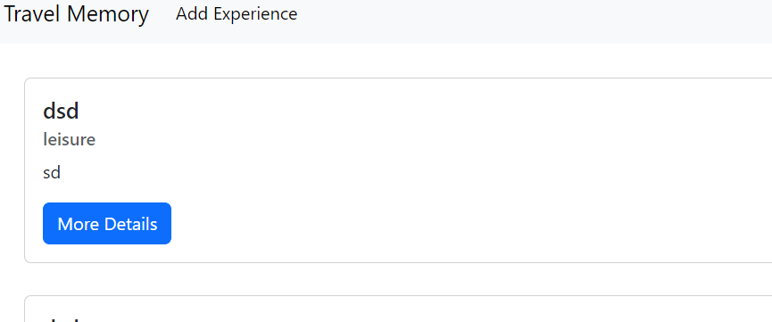
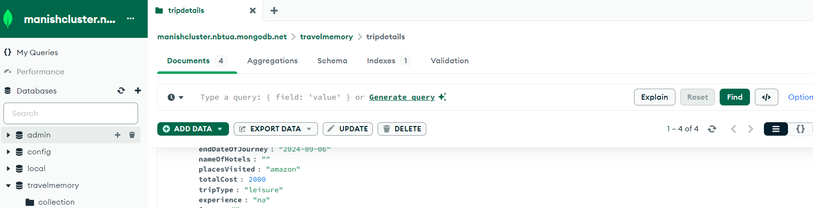

# Terraform_ansible_deployment
# Project Workflow
Infrastructure Setup with Terraform Provision AWS resources: A VPC with a public subnet. An EC2 instance in the public subnet. Security groups to control access to the instance. Application Deployment with Ansible
Install necessary dependencies (Node.js, MongoDB, Nginx). Clone the MERN application repository from repo-https://github.com/UnpredictablePrashant/TravelMemory and set up the frontend and backend.
Nginx Configuration Serve the React frontend. Reverse proxy requests to the backend API.
# Prerequisites
An AWS account with access credentials.
Terraform installed on EC2 workspace.
Ansible installed on EC2 workspace.
An existing AWS key pair for SSH access to the EC2 instance.
# Steps
1. Configured AWS CLI and Set Up Terraform
2. Installed AWS CLI If AWS CLI is not already installed on your EC2 workspace, installed it using the following commands:
```
sudo apt update -y
sudo apt install aws-cli -y
```
3. Configured AWS CLI Ran the following command to configure AWS CLI with your AWS credentials:
```   
aws configure
```
Note- it will ask for:
AWS Access Key ID: Obtained this from AWS IAM account.(security creds) 
AWS Secret Access Key: Obtained this from AWS IAM account.(security creds)
Default region: Entered your preferred region.
Default output format: Entered json.

4. Once the aws configuration was done Created main.tf : 
Placed the provided Terraform configuration file in the terraform folder.
/home/ubuntu/Travelmemory/terraform with the details specified for my ec2:

which had all these details such as AWS region Availability zone Public IP for security group, Key pair name AMI ID

5. Once the main.tf file was prepared 
Initialized the Terraform using:
```
terraform init
```
Validated the configuration:
```
terraform validate
```
Plan and apply the configuration:
```
terraform plan
terraform apply
```
After Terraform applies, it displayed:

The public IP of the web server.

5. Now Configured and Deployed using Ansible
Installed Ansible on EC2 workspace:
Created an inventory file inventory.ini and app_setup.yml which contains the configuration for the frontend conncted to my backend using the mongo- db and for proxy server used nginx in the /Travelmemory/ansible/ directory:
Ran Ansible Playbooks

Navigated to the /Travelmemroy/ansible/ directory:
```
cd ansible
```
Configured the backend server:
```
ansible-playbook -i inventory.ini app_setup.yml
```


